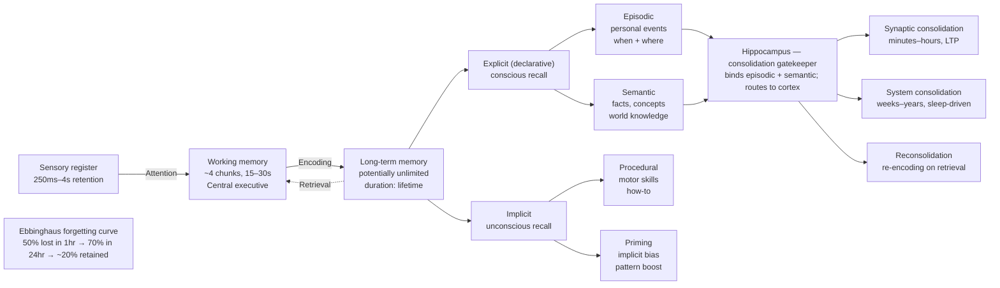
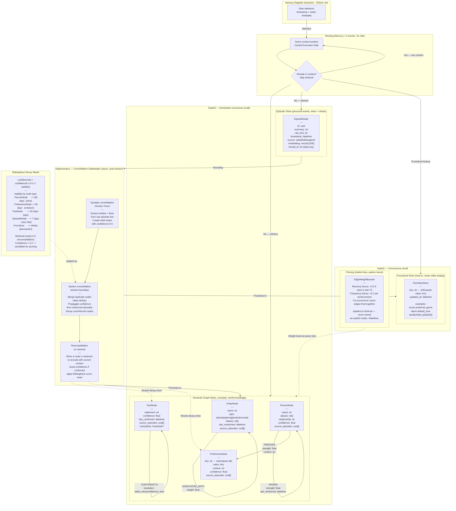
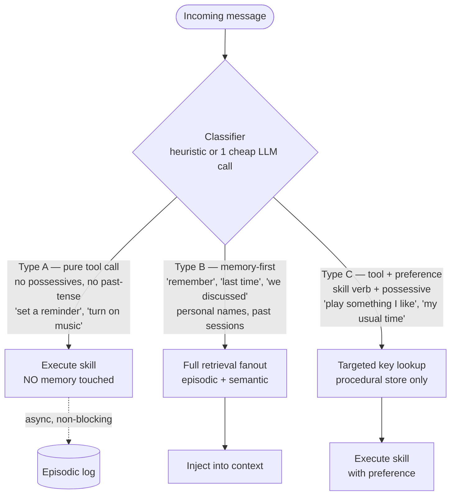
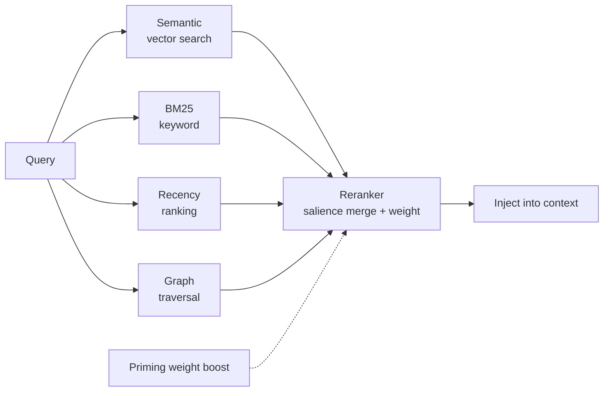
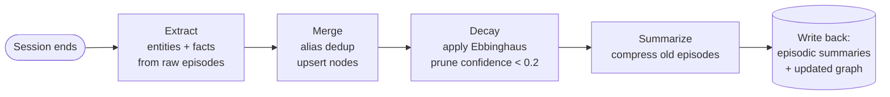

# Memory Architecture — **v2 / Phase 2 (post-ship)**

> **Status: NOT v1. Do not build before September 1, 2026.**
>
> This is the north-star design for agentic memory. It is explicitly **v2**,
> per `desk-robot-plan.md` §1.7 (v1 polish list is three items; memory is not
> one of them) and §7 (memory is Phase 7 "fun stuff"). The whole point of v1
> is getting a *body* on the desk (the Pi/Mac split, `architecture-reset.md`
> Phase 8). Memory is what makes the robot feel like *yours* — but only after
> it exists as a robot.
>
> **What to actually build first:** the [Minimum Viable Memory](#minimum-viable-memory-build-this-first)
> section near the bottom. Same biological spine, ~10% of the machinery, fits
> behind the `recall()` / preference tools already stubbed in
> `architecture-reset.md` Phase 6.1. The full design below is the thing the MVM
> grows *into* — if and when single-user usage actually demands it.

---

## 1. Design principles (these carry from v1 → v2)

1. **Episodic and semantic are separate stores, bound by consolidation.**
   The append-only episodic log is the source of truth. The semantic graph is
   *derived* — if it corrupts, you rebuild it from episodes. The dependency
   direction is one-way: episodes → graph, never the reverse.

2. **Memory retrieval has a cost; most turns don't need it.** A classifier
   gate decides whether to touch memory at all *before* any retrieval. Pure
   tool calls ("play music", "set a reminder") never pay the retrieval tax.

3. **Writes are always async and never block the response.** Even a Type A
   tool call logs its event to the episodic log in the background, so it's
   there for future consolidation without adding latency to the live path.

4. **Consolidation runs off the critical path.** The "sleep cycle" (extract →
   merge → decay → summarize) runs post-session. Live latency is bounded by
   retrieval, never by consolidation.

5. **Single user, single room.** Every decision is evaluated against Austin,
   alone, in his room (`desk-robot-plan.md` §1.5). Features that only matter
   for a hypothetical second user are out of scope.

---

## 2. Biological model (the blueprint)

The architecture is a direct mapping of the human memory model. Each
implementation component traces back to a piece of this:



### Mapping table

| Biology | Implementation |
|---|---|
| Sensory register (250ms–4s) | Raw utterance buffer, discarded after transcription |
| Working memory (~4 chunks) | Active context window; central executive = the classifier gate |
| Episodic (when + where) | `EpisodeNode` append-only log with embeddings + thread_id |
| Semantic (facts, concepts) | The graph: `PersonNode`, `FactNode`, `PreferenceNode`, `EntityNode` |
| Procedural (how-to) | `KeyValueStore` — `music.preferred_genre`, `alarm.default_time` |
| Priming (pattern boost) | Stateless edge-weight booster applied at retrieval — no stored nodes |
| Hippocampus (consolidation) | Async pipeline: synaptic → system → reconsolidation |
| Ebbinghaus forgetting curve | `confidence(t) = c₀ × e^(−t/stability)` — retrieval resets the clock |

---

## 3. Full system architecture



---

## 4. The classifier gate (highest-ROI piece — keep it in v1 if anything)

Memory retrieval is skipped entirely for most turns. A cheap classifier runs
*before* any retrieval and routes the message into one of three buckets.



**Classification heuristics:**

- Known tool-invocation pattern, no possessives, no past-tense reference → **Type A**
- Contains `remember`, `last time`, `my usual`, `we discussed`, `you said`,
  personal names, or temporal references to past sessions → **Type B / C**
- Has both a skill verb *and* a personal possessive (`my`, `I like`,
  `my usual`) → **Type C**

The classifier can be a regex decision tree, a small classifier model, or a
single cheap LLM call with a three-label system prompt. The cost is negligible
compared to a full retrieval. **Writes to the episodic log are always async**,
so even Type A gets logged for future consolidation without blocking.

---

## 5. Retrieval engine (Type B path)

Four parallel search strategies fan out, then a reranker merges by salience.



> **v2 caution (single-user reality):** over a corpus of *your own*
> conversations, recency + a single vector search will capture most of the
> value. BM25, graph traversal, and the reranker are there for when the corpus
> is large enough for the signals to *disagree* — which, for one user, may be
> years away or never. Build the fanout incrementally and only add a strategy
> when you can point at a concrete retrieval failure it fixes.

---

## 6. Semantic graph schema

The graph lives in semantic memory. Episodic is the raw log; consolidation
promotes episodic facts *into* graph nodes.

### Node types

| Node | Key fields | Stability (decay) |
|---|---|---|
| `PersonNode` | name, aliases[], relationship, confidence, source_episodes[] | 180d (slow) |
| `PreferenceNode` | key (`namespace.attr`), value, context, confidence | 60d (medium) |
| `FactNode` | statement, confidence, last_confirmed, source_episodes[] | 30d (fast) |
| `EntityNode` | name, type, aliases[], last_mentioned, source_episodes[] | 60d (slow) |
| `EpisodeNode` | id, summary, raw_text, timestamp, source, embedding, thread_id | 7d (very fast) |

### Edge types (all directed + weighted)

| Edge | Carries |
|---|---|
| `KNOWS` | strength, last_reinforced |
| `PREFERS` | strength, context |
| `RELATED_TO` | type: causal / temporal / semantic |
| `CONTRADICTS` | resolution: latest_wins / confidence_wins |
| `ASSOCIATED_WITH` | weight |

**Every node and edge carries:** `confidence`, `source_episode_ids[]`,
`created_at`, `last_reinforced_at`. Provenance pointers back to the episodic
log are mandatory — a fact you can't trace to an episode is a fact you can't
trust or rebuild.

### The two hard problems

1. **Contradiction resolution.** "Wake-up time is 7am" then "6am". Rule:
   `latest_wins` for preferences; `confidence_wins` for facts (more confirming
   episodes wins). *For a single user, `latest_wins` is correct ~99% of the
   time — the voting machinery is largely insurance.*

2. **Entity deduplication.** "my boss" = "Sarah" = "Sarah Chen" → one node.
   Consolidation checks alias overlap before creating a new node. *At
   single-user scale (~dozens of entities), this is a near-non-problem.*

---

## 7. Priming — a note on what NOT to store

Priming is **stateless** and has **no stored nodes**. It's purely a
retrieval-time weight modifier:

- **Recency bonus:** +0.3 if the node was seen in the last 7 days
- **Frequency bonus:** +0.1 per reinforcement
- **Co-occurrence boost:** edges that fire together get boosted together

Keeping priming out of the stored graph prevents phantom nodes from
accumulating and keeps the graph rebuildable from episodes alone.

---

## 8. Consolidation pipeline (the "sleep cycle")

Runs **async, post-session, off the critical path.**



- **Synaptic (minutes–hours):** extract draft nodes from raw episode text at
  `confidence=0.5`.
- **System (session boundary):** merge duplicates, propagate confidence from
  reinforced episodes, decay the unreinforced.
- **Reconsolidation (on retrieval):** retrieving a node re-encodes it with
  current context, boosts confidence if confirmed, resets its decay clock.

---

## 9. Ebbinghaus decay model

```
confidence(t) = confidence_0 × e^(−t / stability)
```

| Node type | Stability | Behavior |
|---|---|---|
| PersonNode | 180 days | slow |
| EntityNode | 60 days | slow |
| PreferenceNode | 60 days | medium |
| FactNode | 30 days | fast |
| EpisodeNode | 7 days | very fast |
| Procedural store | ∞ | permanent |

- Retrieval resets `t = 0` (reconsolidation).
- `confidence < 0.2` → candidate for pruning.

> **v2 caution:** decay is the most *principled-feeling* part of this design
> and therefore the most suspect. It manages a scale problem (too many
> memories) that a single desk user won't hit for a long time. In the MVM
> below it's replaced by "re-confirm on use, let stale facts sit." Add real
> decay only when you have a real pruning problem.

---

## Minimum Viable Memory (build this first)

Same biological spine, ~10% of the machinery. Fits behind the `recall()` /
preference-lookup tools already stubbed in `architecture-reset.md` Phase 6.1.
This is what you build *if* you build memory before the robot has a body —
otherwise it waits until after September 1.

**Storage — three SQLite tables, no graph DB, no vector store at first:**

```sql
-- Episodic: source of truth, append-only. (SqliteSaver already exists;
-- this is the durable summary layer alongside it.)
CREATE TABLE episodes (
    id          TEXT PRIMARY KEY,   -- uuid
    ts          TEXT NOT NULL,      -- ISO datetime
    thread_id   TEXT NOT NULL,      -- daily key (already in config.daily_thread_id)
    summary     TEXT,
    raw         TEXT,
    embedding   BLOB                -- optional; add when recall needs it
);

-- Semantic "graph" as triples. A triple IS an edge — this is a graph
-- without a graph database. Query with plain SQL.
CREATE TABLE facts (
    subject           TEXT NOT NULL,
    predicate         TEXT NOT NULL,
    object            TEXT NOT NULL,
    confidence        REAL DEFAULT 0.5,
    last_confirmed    TEXT,
    source_episode_id TEXT REFERENCES episodes(id)
);

-- Procedural / preference store. This is the Type C lookup, literally.
CREATE TABLE preferences (
    key         TEXT PRIMARY KEY,   -- e.g. music.preferred_genre
    value       TEXT,
    updated_at  TEXT
);
```

**What maps to what:**

- **Episodic log** → you already have it (`state/conversations.db` via
  SqliteSaver). Add the `episodes` summary table.
- **Semantic graph** → the flat `facts` triples table. Triples are edges; SQL
  is your traversal.
- **Procedural store** → the `preferences` table = the Type C key lookup.
- **Retrieval** → recency + one vector similarity (sqlite-vec, or cosine in
  Python over a few thousand rows — you will not have more). **No BM25, no
  reranker** until you can point at a real retrieval failure.
- **Consolidation** → one async job at session end: summarize the thread,
  extract new facts/preferences, upsert, **latest-wins on conflict**. No decay
  scheduler — re-confirm on use, let stale facts sit. Pruning is a problem for
  the day you have a pruning problem.
- **Classifier gate** → keep it exactly as designed in §4. This is the part
  with real ROI and it's cheap.

**What the MVM deliberately drops (and when to add it back):**

| Dropped | Add back when |
|---|---|
| Graph database | SQL joins on `facts` actually become the bottleneck |
| 4-way retrieval fanout | recency + vector demonstrably misses things |
| Reranker | the retrieval signals start disagreeing meaningfully |
| Entity dedup voting | you have enough entities that collisions actually happen |
| Confidence-wins contradiction | latest-wins produces a wrong answer you can point at |
| Ebbinghaus decay scheduler | the store is big enough that pruning matters |

The full design in §§3–9 is the north star the MVM grows into. Don't pay for
it in June.

---

## Relationship to the other planning docs

- `desk-robot-plan.md` — the product plan. Memory is Phase 7 / v2 there (§7,
  §9). This doc is the detailed design for that future phase.
- `architecture-reset.md` — the code-migration plan. Phase 6.1 already stubs
  `recall(query)` and `forget_session` tools and a `SqliteSaver`. The MVM
  above is the concrete build behind those stubs.
- **Ship order is unchanged:** v1 = robot with a body (Pi/Mac split, Phase 8).
  Memory does not displace it.
</content>
</invoke>
